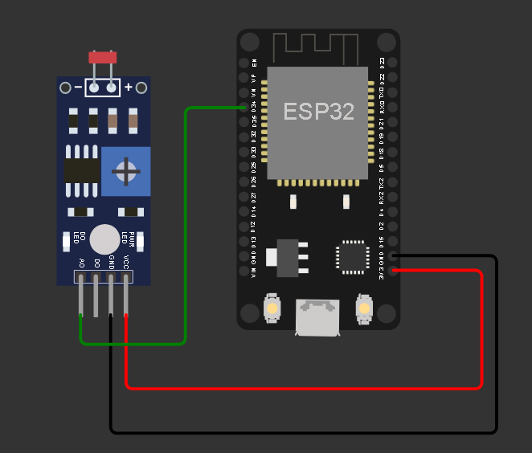

# 💡 Projeto IoT - Smart Lamp com FIWARE e MQTT  

---

## 📌 Descrição do Projeto  
Este projeto implementa uma **Smart Lamp** (Lâmpada Inteligente) conectada à Internet das Coisas (**IoT**) utilizando **ESP32**, **MQTT** e a **plataforma FIWARE**.  

A Smart Lamp pode ser **ligada e desligada remotamente** via **comandos MQTT**, além de enviar continuamente o **estado do LED** e os **valores de luminosidade** para o **Broker MQTT**, permitindo integração com aplicações externas, dashboards e sistemas de automação.  

---

## 📷 Imagem do Protótipo


---

## ⚙️ Funcionalidades  
✔️ Conexão Wi-Fi com autenticação.  
✔️ Conexão ao **Broker MQTT**.  
✔️ Recebimento de comandos MQTT para **ligar/desligar** a lâmpada.  
✔️ Publicação do **estado atual da lâmpada**.  
✔️ Leitura da **luminosidade ambiente** (sensor analógico).  
✔️ Publicação dos valores de luminosidade em tempo real.  
✔️ Reconexão automática ao **Wi-Fi** e **MQTT** em caso de falha.  

---

## 🔧 Componentes Utilizados  
| Componente          | Quantidade | Função no Projeto |
|---------------------|------------|-------------------|
| ESP32 DevKit        | 1          | Microcontrolador principal com Wi-Fi integrado |
| LED (Onboard D4)    | 1          | Representa a lâmpada inteligente |
| LDR                 | 1          | Simula sensor de luminosidade |
| Broker MQTT (FIWARE/Orion) | 1 | Comunicação entre IoT e Backend |
| Jumpers             | -          | Conexões de teste |

---

## 📦 Dependências do Projeto  
- **Linguagem:** C++ (Ex: Arduino IDE/ PlatformIO)
Antes de compilar e carregar o projeto na placa ESP32, certifique-se de instalar as seguintes bibliotecas na IDE do Arduino:
- **Bibliotecas:**  
  - `WiFi.h` → Gerencia a conexão Wi-Fi.  
  - `PubSubClient.h` → Implementa o protocolo MQTT no ESP32.  

---

## 🏗️ Arquitetura e Contexto do Projeto  
O projeto **Smart Lamp** foi desenvolvido como uma **PoC (Proof of Concept)** para demonstrar como a plataforma **FIWARE** pode ser utilizada em conjunto com dispositivos **IoT (ESP32)**, protocolos **MQTT** e serviços em nuvem (como **Azure VM**).  

A arquitetura segue o padrão em **camadas**:  
### 📌 Arquitetura em Camadas  
1. **Camada IoT (Dispositivo Físico)**  
   - O **ESP32** coleta dados de luminosidade (via potenciômetro/LDR).  
   - Envia esses dados ao **Broker MQTT**.  
   - Recebe comandos para ligar/desligar a lâmpada.   

2. **Camada Backend (FIWARE)**  
   - **Orion Context Broker** → gerencia o contexto da lâmpada (estado ON/OFF).  
   - **STH-Comet** → armazena histórico de luminosidade.  
   - **IoT Agent MQTT** → traduz mensagens MQTT em entidades FIWARE.  
   - **MongoDB** → banco de dados dos contextos.  
   - **Eclipse-Mosquitto** → broker MQTT responsável pela comunicação.   

3. **Camada Aplicação (Interface do Usuário)**  
   - Usuário envia comandos de ligar/desligar via Postman ou interface FIWARE.  
   - Visualiza estado atual da lâmpada e histórico de luminosidade.  

### ⚙️ Instalação e Configuração  
O FIWARE Descomplicado foi instalado em uma máquina virtual do Microsoft Azure.
#### 1️⃣ Clonar e iniciar o FIWARE Descomplicado:  
```bash
git clone https://github.com/fabiocabrini/fiware
cd fiware
sudo docker-compose up -d
```

#### 2️⃣ Configurar portas no firewall da VM:
- `1026/TCP` → Orion Context Broker

- `1883/TCP` → Mosquitto (MQTT)

- `4041/TCP` → IoT-Agent MQTT

- `8666/TCP` → STH-Comet

#### 3️⃣ Ajustar credenciais no código do ESP32:
```cpp
const char* default_SSID = "sua_rede_wifi";
const char* default_PASSWORD = "sua_senha_wifi";
const char* default_BROKER_MQTT = "ip_host_fiware";
```

### 💡 Criação da Entidade Lógica (PoC Smart Lamp)
No FIWARE, a lâmpada é representada como uma entidade lógica, chamada Smart Lamp:
- ID: lamp001
- Atributos de Estado: ligado/desligado
- Atributos de Sensoriamento: luminosidade (0–100%)
- Comandos: ligar/desligar

Fluxo da entidade:
1. O ESP32 publica luminosidade em `/TEF/lamp001/attrs/l`.
2. O ESP32 publica estado atual em `/TEF/lamp001/attrs`.
3. O ESP32 recebe comandos do broker em `/TEF/lamp001/cmd`.

---

### 📊 Diagrama da Arquitetura  
```plaintext
[Usuário/Postman] <---> [FIWARE Orion/IoT Agent] <---> [Broker MQTT] <---> [ESP32 Smart Lamp]
```

---

## 📂 Estrutura do Projeto
```plaintext
📁 smart-lamp-fiware
│── 📄 README.md                 # Documentação do projeto
│── 📄 smartlamp.ino             # Código principal para o ESP32
│── 📁 /img                      
   │── 📷 circuito-poclamp.png   # Imagem do projeto
```

---

## 🛠️ Como Montar e Replicar este Projeto

### 1. Montagem do Circuito

- Instale a Arduino IDE e selecione a placa ESP32 Dev Module.

- Conectar LDR ao pino 34 (ADC) do ESP32.

- Utilizar o LED onboard (D4) para simular a lâmpada.

### 2. Bibliotecas
- Instale as bibliotecas WiFi.h e PubSubClient.h.

### 3. Configuração do Código
- Copie o código-fonte fornecido.
- Editar no código os parâmetros:

   ```cpp
   const char* default_SSID = "sua_rede_wifi";
   const char* default_PASSWORD = "sua_senha_wifi";
   const char* default_BROKER_MQTT = "ip_host_fiware";
   const int default_BROKER_PORT = 1883;
   ```

### 4. Execução do Sistema

- Carregar o código no ESP32.
- Abra o Serial Monitor (115200 baud) para acompanhar logs.
- Usar o Postman para enviar comandos e monitorar o LED.
- Confira a publicação automática da luminosidade (0–100%).

---

## 🧠 Lógica de Sistema
1. O ESP32 conecta ao Wi-Fi.

2. O ESP32 conecta ao Broker MQTT.

3. O dispositivo escuta no tópico:
   ```bash
   /TEF/lamp001/cmd
   ```

4. Se recebe comando lamp001@on| → Liga LED.

5. Se recebe comando lamp001@off| → Desliga LED.

6. Publica estado em:
   ```bash
   /TEF/lamp001/attrs
   ```

e luminosidade em:
   ```bash
   /TEF/lamp001/attrs/l
   ```

---

## 🖥️ Operação
### Comandos de Teste (via Postman / MQTT)
- #### Ligar Lâmpada
   ```json
   lamp001@on|
   ```

- #### Desligar Lâmpada
   ```json
   lamp001@off|
   ```

---

## ⚠️ Notas de Segurança
- ***Não compartilhar credenciais Wi-Fi e Broker*** em repositórios públicos.

- ***Alterar o ID MQTT*** ao utilizar múltiplos dispositivos.

- ***Verificar firewall da rede*** para permitir portas MQTT (1883).

---

## 📚 Recursos e Materiais
- [Repositório FIWARE Descomplicado](https://github.com/fabiocabrini/fiware)

---

## 🎥 Vídeo Explicativo

📺 Assista ao vídeo explicando o projeto: [Link para o vídeo](https://youtu.be/EQW0LHzMcRQ?si=Eq8QhTGj2LVnmyAi)

---

## ⌨ Simulação no Wokwi

🖲 [Clique aqui para abrir](https://wokwi.com/projects/441493110503103489)

---

## 👨‍💻 Autores

- Projeto desenvolvido por **Visionary Solutions** para a disciplina Edge Computing - FIAP.
- Equipe: Arthur Araujo Tenorio, Breno Gonçalves Báo, Rodrigo Cardoso Tadeo, Vinicius Cavalcanti dos Reis
- Professor: Dr. Fábio H. Cabrini

---

## 📢 Licença

Este projeto é livre para uso educacional. Para uso comercial, consulte os autores.